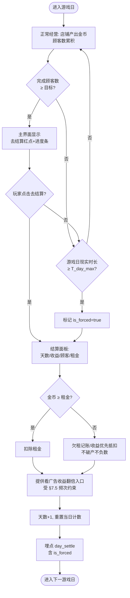
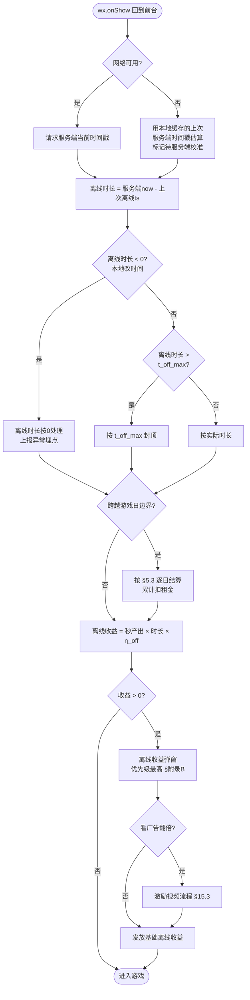
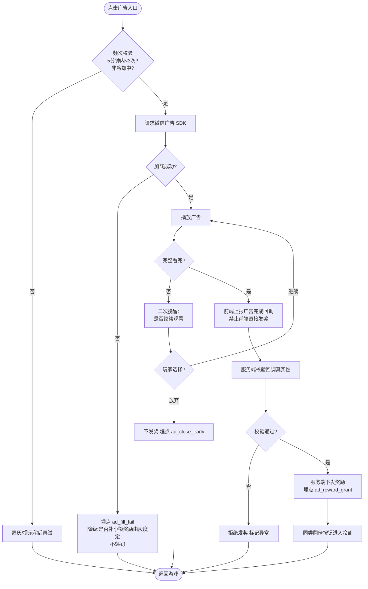
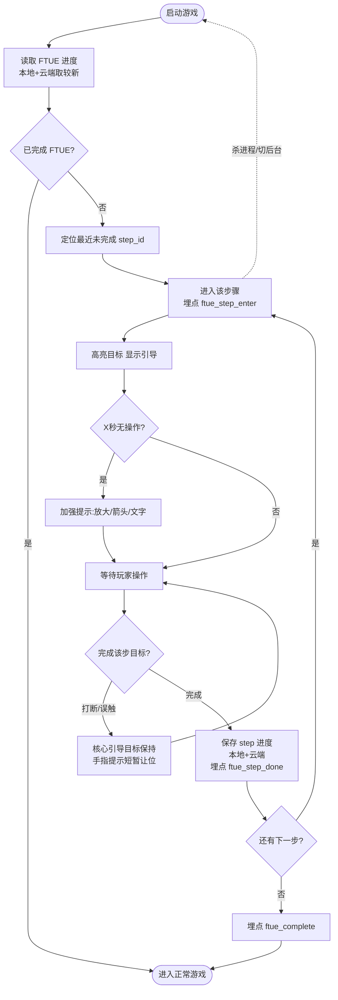
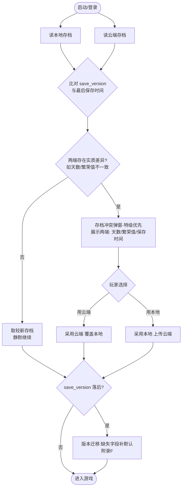
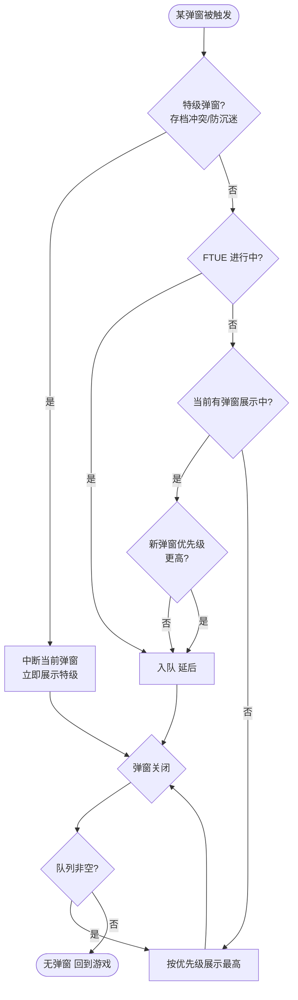
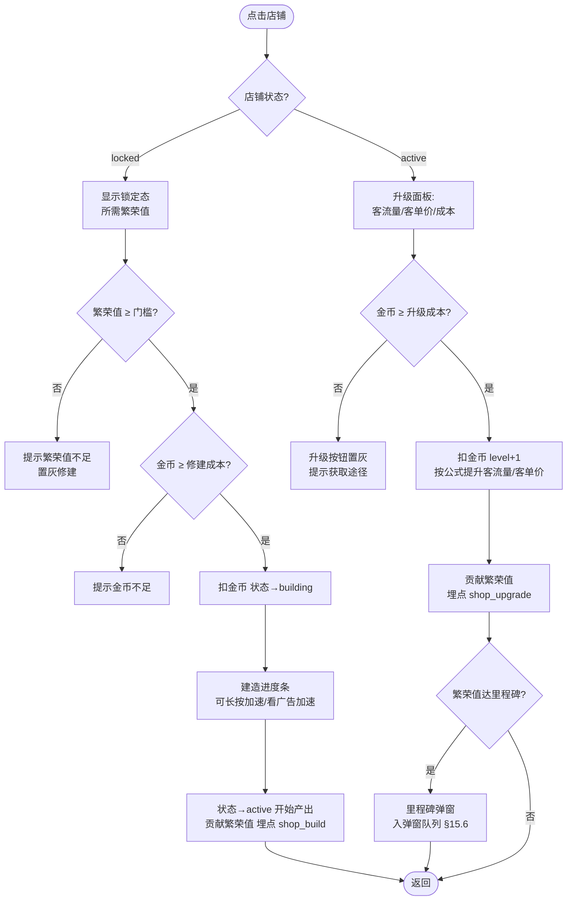

# 《老街新生》放置经营小游戏 — 产品需求文档（PRD）

> 项目代号：暂定《老街新生》（对外名称待市场/法务确认，不得沿用参考产品名称）
> 文档类型：产品需求文档（Product Requirements Document）
> 适用平台：微信小游戏（后续可拓展抖音小游戏 / QQ 小游戏）
> 编写视角：微信小游戏产品负责人

---

## 0. 文档信息

### 0.1 修订记录

| 版本 | 日期 | 修订人 | 说明 |
|------|------|--------|------|
| v0.1 | 2026-08-20 | 产品 | 基于竞品拆帧分析（`游戏内容和玩法总结.md`）初稿 |
| v0.2 | 2026-08-20 | 产品 | 按专业评审意见修订：修复结算逻辑漏洞、补充非功能需求/埋点/弹窗互斥/防作弊/防沉迷/存档冲突等，见 §0.4 评审响应记录 |
| v0.3 | 2026-08-20 | 产品 | 新增 §15 核心功能流程图（Mermaid）；新增附录 G 扩充异常场景（时间回拨/发奖失败/存档损坏/多端登录等） |

### 0.2 文档状态说明

本 PRD 基于对同类竞品录屏的逆向分析编写，属**立项级需求文档**。其中：

- **玩法机制、系统结构、信息架构** — 分析置信度高，作为需求基线。
- **所有数值（成本、产出、阈值、倍率等）** — 均为产品侧**设计假设值**，标注 `【待验证】`，须经数值策划建模与灰度测试确认，禁止直接作为实现依据。
- **美术风格** — 仅提供方向性描述，以美术设计稿为准。
- **交付边界** — 本文档（v0.2）可用于立项评审与 M1 数值建模启动；正式交付研发前，须完成竞品实机体验校验（见 §14）与低保真原型附件（见 §13.1）。

### 0.4 评审响应记录

针对《PRD 专业评审报告》逐条响应，改动可追溯：

| 评审项 | 处置 | 落地位置 |
|--------|------|---------|
| 一.1 缺原型/交互附件、滚动方向未定 | 采纳 | §8.1（滚动方向）、§13.1（原型附件位） |
| 一.2 非功能需求分散、切后台/弱网缺失 | 采纳 | 新增 §9.3 非功能性需求 |
| 一.3 埋点笼统无事件清单 | 采纳 | 新增 附录 A 埋点事件清单 |
| 一.4 待确认项未分阻塞级别 | 采纳 | §14 加阻塞级别标记 |
| 一.5 配置热更失败无兜底 | 采纳 | §9.3、TR-9.8 |
| 二.1 结算逻辑漏洞（可无限卡日刷金币） | 采纳 | §5.3 重写 |
| 二.2 策略卡缺口（重复卡/禁用/MVP无差异） | 采纳 | §5.4 增 P0-Lite + 重复处理 + 禁用 |
| 二.3 FTUE 无断点续跑 | 采纳 | §4.3 补充 |
| 二.4 繁荣值无消耗出口 | 部分采纳（P1 可选消耗，不改只增不减主轴） | §5.2 |
| 二.5 离线系数过低风险 | 采纳 | §5.6 加风险备注 |
| 三.1 弹窗互斥优先级 | 采纳 | 新增 §7.5 + 附录 B |
| 三.2 广告频次硬约束 | 采纳 | §7.5 |
| 三.3 Banner/插屏定义模糊 | 采纳 | §7.3 补充 |
| 三.4 去广告卡架构预留 | 采纳 | TR-9.9 |
| 三.5 广告任务合规风险 | 采纳（任务改为间接行为） | §6.1 重写 |
| 四.1 排行榜授权拒绝降级 | 采纳 | §6.3 补充 |
| 五.1 防作弊业务清单 | 采纳 | §10.4 服务端校验清单 |
| 五.2 防沉迷单薄 | 采纳 | §10.5 |
| 五.3 双存档冲突 | 采纳 | TR-9.3 重写 + §9.3 |
| 六.1 指标无灰度预警阈值 | 采纳 | §3 补充预警阈值 |
| 六.2 北极星乘法误导 | 采纳（改 7 日 LTV，指标独立观测） | §3 重写北极星 |
| 七 P1 体量过大 | 采纳（P1 拆分 P1-1/P1-2） | §11 重排 |
| 八 建议附录模块 | 采纳 | 附录 A–E |

### 0.3 术语表

| 术语 | 定义 |
|------|------|
| 客流量 | 单位时间内到访某店铺的顾客数，决定收益产生频率 |
| 客单价（基础消费） | 单个顾客单次消费额，决定单次收益 |
| 繁荣值 | 长线进度货币，用于解锁新店铺与新内容，不可直接购买 |
| 金币 | 软货币主资源，用于修建/升级店铺 |
| 策略卡 | 提供全局增益的 Roguelite 卡牌，分加成区与乘算区 |
| 游戏日 | 一个经营结算周期，达成顾客目标并缴租金后推进 |
| 激励视频 | 微信广告 SDK 提供的可获奖励的视频广告（Rewarded Video） |
| 离线收益 | 玩家离线期间按公式补算的挂机产出 |
| DAU / 次留 / 7留 | 日活 / 次日留存 / 7 日留存 |
| eCPM | 每千次广告展示收益，广告变现核心指标 |
| LTV | 单用户生命周期价值 |

---

## 1. 产品概述

### 1.1 一句话定义

一款以"怀旧市井、重建老街"为主题的**放置经营模拟（Idle Tycoon）+ 轻 Roguelite 策略卡**微信小游戏，玩家从一间小铺起步，通过挂机经营、店铺升级、策略卡构筑，逐步复兴一整条老商业街。

### 1.2 产品愿景

以"从一家小铺开始，找回那份最简单的快乐"为情感锚点，为休闲玩家提供**低操作门槛、强正反馈、可长线经营**的治愈系放置体验。

### 1.3 设计支柱（Design Pillars）

1. **轻操作、强反馈**：单手竖屏，核心操作为"点击升级 / 长按加速"，每一步都有可见的数值成长与画面变化。
2. **挂机友好**：离线也在赚钱，回归即有正反馈，符合碎片化使用场景。
3. **策略深度可选**：策略卡系统为核心玩家提供 build 构筑空间，但不强制，休闲玩家可无脑推进。
4. **怀旧治愈基调**：暖色调市井美术、老物件店铺，营造情绪价值而非竞争压力。

### 1.4 平台特性约束（微信小游戏）

- 包体：主包 ≤ 4MB（微信硬性限制），其余资源走分包 / 远程加载 CDN。
- 竖屏、单手操作为主，兼容主流机型分辨率（设计基准 720×1546，等比适配）。
- 社交链路：微信排行榜（`wx.getFriendCloudStorage`）、分享、群裂变。
- 变现以激励视频为主，遵守微信广告组件规范与频次限制。
- 首屏加载与冷启动性能受微信审核关注，需做加载优化。

---

## 2. 市场与目标用户

### 2.1 目标用户画像

| 维度 | 描述 |
|------|------|
| 核心人群 | 25–45 岁泛休闲用户，微信生态高活跃，偏好轻度挂机/经营品类 |
| 性别 | 偏均衡，怀旧主题对下沉市场与女性用户友好 |
| 使用场景 | 碎片时间（通勤、午休、睡前），单次时长 3–10 分钟，多次回访 |
| 付费/变现意愿 | 付费意愿低但**广告接受度高**，愿意为"翻倍/加速"主动看广告 |

### 2.2 竞品定位

放置经营品类在微信小游戏买量榜长期活跃，本产品以"怀旧市井 + 策略卡"做差异化。竞品验证了品类可行性，本产品需在**美术情绪价值**与**策略卡构筑深度**上建立辨识度。

---

## 3. 产品目标与核心指标（KPI）

> 以下为立项目标，需在灰度期校准。

| 指标类别 | 指标 | 首月目标 `【待验证】` | 灰度预警阈值（触发即复盘） |
|---------|------|----------|--------------------------|
| 留存 | 次日留存 | ≥ 35% | < 25% 🔴 紧急复盘 |
| 留存 | 7 日留存 | ≥ 12% | < 8% 🔴 |
| 时长 | 人均单日时长 | ≥ 12 分钟 | < 6 分钟 🟠 |
| 时长 | 人均单日启动次数 | ≥ 4 次 | < 2 次 🟠 |
| 变现 | 人均单日激励视频观看次数 | ≥ 6 次 | < 3 次 🟠 广告场景失效 |
| 变现 | ARPU（广告为主） | ≥ ¥0.15 | < ¥0.08 🟠 |
| 传播 | 分享率 | ≥ 8% | < 3% 🟡 |

**北极星指标（修订）**：**7 日 LTV**（单用户 7 日生命周期价值，同时内含留存与变现，且不会因牺牲留存换广告密度而被刷高）。

> 修订说明（响应评审六.2）：原"人均激励视频观看 × 次留"的乘积式北极星存在方向误导——通过拉高广告密度牺牲留存仍可能获得较高乘积。现改为 **7 日 LTV 为唯一北极星**；次留、7留、人均广告观看次数、时长等作为**独立观测指标**，不做乘法合并，各自设预警阈值，避免单一维度被过度优化。

---

## 4. 核心玩法循环

### 4.1 玩法循环图

```
        ┌──────────────────────────────────────────────┐
        │                                              │
        ▼                                              │
  修建/升级店铺 ──► 客流量↑ 客单价↑ ──► 挂机产出金币 ──► 金币回流
   (消耗金币)                              │
        ▲                                  ▼
        │                          繁荣值累积 ──► 达阈值解锁新店铺
        │                                  │
   策略卡全局增益 ◄── 抽卡/刷新              ▼
        ▲                          每日结算(顾客数达标+缴租金)──► 推进游戏日
        │                                  │
        └──────── 激励视频(翻倍/加速) ◄──────┘
```

### 4.2 核心循环文字描述

1. **产出**：店铺按 `客流量 × 客单价` 自动产出金币（在线 + 离线）。
2. **成长**：金币用于升级/修建店铺，提升客流量与客单价。
3. **解锁**：经营积累繁荣值，达阈值解锁新店铺与新玩法。
4. **节奏**：每个游戏日需完成顾客数目标并缴纳租金，达成后推进天数，形成关卡化节奏。
5. **策略**：策略卡提供全局加成/乘算增益，构筑收益 build。
6. **放大**：激励视频提供收益翻倍与加速，是玩家自愿的加速杠杆。

### 4.3 首次游玩体验（FTUE）流程 — P0

新手前 3 分钟必须完成一次完整正反馈闭环：

1. 进入 → 拥有第 1 家店铺（已在产出）。
2. 引导点击"收取金币"→ 数字跳动正反馈。
3. 引导"升级店铺"→ 客流量/客单价可见提升。
4. 引导"长按加速"→ 快速看到收益堆叠。
5. 繁荣值达第一个阈值 → 解锁第 2 家店铺（首次解锁高光演出）。
6. 触发第一次"看广告翻倍"引导 → 建立广告心智。
7. 首个游戏日结算 → 认知"顾客目标 + 租金 + 推进天数"节奏。

**FTUE 断点与容错（P0，响应评审二.3）**
- FR-4.3.1（P0）：引导以"步骤 ID"记录进度，本地 + 云端双存。玩家中途杀进程/切后台/误触打断后，重启从**最近未完成步骤断点续跑**，不从头重来、不卡死。
- FR-4.3.2（P0）：引导允许被打断——玩家点击非引导热区时，引导手指提示可短暂让位，但核心引导目标（如"升级"按钮高亮）保持，直至该步完成。
- FR-4.3.3（P0）：每个引导步骤设"防呆兜底"：若玩家 X 秒无操作，加强提示（放大/箭头/文字），避免新手迷失。
- FR-4.3.4（P1）：FTUE 每步进出埋点，用于分析新手流失漏斗（见附录 A）。

---

## 5. 功能系统需求详述

> 优先级定义：**P0**=MVP 必做（上线核心闭环）；**P1**=首版应有（完善体验与变现）；**P2**=迭代增强。

### 5.1 店铺经营系统（P0）

**5.1.1 功能描述**
店铺是核心经营单元。每家店铺具备独立的等级、客流量、客单价，玩家消耗金币升级以提升产出。

**5.1.2 数据结构**

| 字段 | 类型 | 说明 |
|------|------|------|
| shopId | int | 店铺唯一 ID |
| type | enum | 店铺类型（配钥匙铺/自行车铺/纪念品铺…） |
| level | int | 当前等级 |
| hourlyTraffic | float | 每小时客流量 |
| baseSpend | float | 基础消费（客单价） |
| unlockProsperity | int | 解锁所需繁荣值 |
| state | enum | locked / building / active |

**5.1.3 功能需求**

- FR-5.1.1（P0）：店铺解锁后自动持续产出金币，无需玩家值守。
- FR-5.1.2（P0）：单次产出 = `客流量 × 客单价 × 全局增益系数`；产出以合适的可视节奏结算（如按秒累积、可点击收取或自动入账，交互方式二选一，建议自动入账 + 冒字反馈）。
- FR-5.1.3（P0）：点击"升级"消耗金币，提升该店铺 level，并按公式提升 hourlyTraffic 与 baseSpend。
- FR-5.1.4（P0）：升级成本随等级增长，采用指数模型 `cost = base × rate^(level-1)`，`rate` `【待验证】` 建议 1.07–1.15 区间。
- FR-5.1.5（P0）："修建"新店铺需满足繁荣值门槛 + 金币消耗；修建过程可"长按加速"。
- FR-5.1.6（P1）：每家店铺达到特定等级触发外观进化（视觉正反馈）。
- FR-5.1.7（P1）：一键升级 / 批量升级（升到买得起的最高级），降低操作疲劳。

**5.1.4 边界与异常**
- 金币不足时升级按钮置灰并提示获取途径。
- 繁荣值不足时新店铺显示锁定态与所需繁荣值。

### 5.2 繁荣值系统（P0）

**5.2.1 功能描述**
繁荣值是长线进度主轴，衡量老街整体繁荣程度，用于解锁新店铺、新区域、里程碑奖励。

**5.2.2 功能需求**
- FR-5.2.1（P0）：繁荣值随店铺升级/修建增长（每次店铺成长贡献一定繁荣值）。
- FR-5.2.2（P0）：达到解锁阈值时，对应新店铺/区域变为可修建，阈值随进度递增。
- FR-5.2.3（P1）：繁荣值达里程碑（如 110、500、1000…）触发里程碑奖励弹窗，奖励可含金币、加速道具、激励视频翻倍机会。
- FR-5.2.4（P0）：繁荣值作为进度主轴**只增不减、不可直接购买**（保证进度纯粹性）。
- FR-5.2.5（P1，响应评审二.4）：为缓解后期"繁荣值无限累积、感知下降"，可**新增可选消耗出口**——在保持"解锁门槛不消耗"主轴不变的前提下，开放少量派生消耗场景（如消耗繁荣值刷新策略卡商店、兑换限定装饰）。此为可选增益出口，非进度必需，避免破坏长线成长感。

### 5.3 每日结算系统（P0）

**5.3.1 功能描述**
游戏以"游戏日"为经营周期，每日需完成顾客数目标并缴纳租金，达成后进入下一日，形成关卡化节奏与经营张力。

**5.3.2 结算面板字段**

| 字段 | 说明 |
|------|------|
| 天数 | 当前第 N 天 |
| 当日收益 | 本游戏日累计金币产出 |
| 完成顾客数 / 目标 | 如 45 / 60，达标为过关条件 |
| 特殊顾客数 | 当日到访的特殊顾客数量 |
| 租金 | 本日固定支出，结算时扣除 |
| 挑战完成情况 | 当日额外挑战目标 |

**5.3.3 功能需求（重写，响应评审二.1 结算逻辑漏洞）**

> 漏洞背景：原设计"未达标不推进、租金仅结算时扣除、无最大时长"→ 玩家可长期不结算、卡在同一天无限刷金币、租金永不扣取，破坏经济模型。以下重写堵住该漏洞。

- FR-5.3.1（P0）：游戏日以"完成目标顾客数"为主结束条件；**同时设游戏日现实最大时长阈值 `T_day_max`（`【待验证】` 示例 8 小时现实时间）**，达阈值即触发**强制结算**，防止无限卡日刷金币。
- FR-5.3.2（P0）：**无论手动结算还是超时自动强制结算，均执行租金扣减**（租金不可通过"不结算"规避）。租金随天数递增。
- FR-5.3.3（P0）：达成顾客目标后，玩家可主动点"去结算"推进下一天；未主动结算且未达时长阈值期间，经营正常继续（收益照常累积），但**租金按"应结算日"记账**——即推进 N 天必累计扣 N 天租金，杜绝套利。
- FR-5.3.4（P0）：未达顾客目标时的处理：**不失败、不惩罚**（治愈系定位），仅不满足"主动结算推进"条件；若达时长阈值则按当前进度强制结算并推进（保证天数与租金正常前进）。
- FR-5.3.5（P0）：主界面常驻**顾客目标进度条**（如 45/60）；达标时"去结算"按钮出现**红点强提醒 + 轻动效**，确保玩家感知需要结算，避免因不知情而滞留。
- FR-5.3.6（P1）："挑战"提供当日额外目标（如"服务 X 个特殊顾客"），奖励道具或翻倍机会。
- FR-5.3.7（P1）：结算面板提供"看广告使当日收益翻倍"入口（受 §7.5 弹窗互斥与频次约束）。

**5.3.4 边界与异常**
- 强制结算时若金币不足以缴租金：不允许负债破产（治愈系），按"欠租"记账或以当日收益优先抵扣，具体规则 `【待验证】`，须在数值文档定义，禁止出现卡死或负数货币。
- 切后台/离线跨越游戏日边界的结算处理，见 §9.3 非功能需求。

**5.3.5 特殊顾客（P1）**
- 特殊顾客为高价值/事件型顾客，客单价显著高于普通顾客或附带额外奖励。
- 触发方式：随机到访 / 宣传触发 / 挑战目标关联。具体规则 `【待验证】`。

### 5.4 策略卡系统（差异化核心，分 P0-Lite / P1）

**5.4.1 功能描述**
Roguelite 式卡牌系统，提供全局增益，是核心玩家的 build 构筑与收益放大层。

> **优先级调整（响应评审二.2）**：原方案整体放 P1，导致 MVP 与竞品无差异、内测无法收集差异化玩法反馈。现拆分：**P0-Lite** 版本进 MVP（少量基础卡、无稀有度/图鉴/套装），验证核心玩法手感；完整卡池、保底、图鉴、套装放 P1。

**5.4.0 P0-Lite 极简策略卡（MVP 必做）**
- FR-5.4.0.1（P0）：提供 `【待验证】` 少量（如 6–10 张）基础卡牌，仅加成区效果（如"全局客流量 +X%""全局客单价 +X%""租金 -X%"），无稀有度分层、无图鉴、无套装。
- FR-5.4.0.2（P0）：玩家可在有限卡槽内装配卡牌，体验 build 差异；抽卡来源限定（如每日 1 次 + 里程碑）。
- 目的：以最小成本让 MVP 具备差异化玩法，供内测收集反馈。

**5.4.2 数据结构**

| 字段 | 类型 | 说明 |
|------|------|------|
| cardId | int | 卡牌 ID |
| rarity | enum | 普通/稀有/史诗/传说 |
| effectType | enum | 加成区(additive) / 乘算区(multiplicative) |
| target | enum | 全局客流量 / 全局客单价 / 特定店铺类型 / 租金减免 等 |
| value | float | 增益数值 |
| owned | bool | 是否已拥有 |

**5.4.3 功能需求（P1 完整版）**
- FR-5.4.1（P1）：玩家周期性获得抽卡机会（如每日/每繁荣里程碑/看广告）。
- FR-5.4.2（P1）：卡牌效果全局生效，分**加成区**（先加）与**乘算区**（后乘），结算顺序须在数值文档中明确定义，防止数值失控。
- FR-5.4.3（P1）：抽卡可"刷新"，并有保底机制——连续刷新 N 次（如 5 次）必得指定稀有度卡牌。
- FR-5.4.4（P1）：卡牌可收集，展示"已拥有/未拥有"，形成图鉴收集动机。
- FR-5.4.5（P1，响应评审二.2）：**重复卡牌处理**——获得已拥有卡牌时，按统一规则转化，方案三选一（**建议：转化为卡牌升级碎片**，升级提升该卡数值；备选：直接升级 / 折算金币）。方案在 P1 立项前锁定，全局唯一，禁止出现"重复卡无处理"的未定义状态。
- FR-5.4.6（P1，响应评审二.2）：**卡牌禁用开关**——玩家可临时禁用/启用单张已装配卡牌（不消耗、不销毁），方便对比体验不同 build，禁用状态本地+云端保存。
- FR-5.4.7（P2）：卡牌组合形成套装效果（进阶 build 深度）。

**5.4.4 数值风控**
- 乘算区卡牌须设**总量上限 `G_max`**（响应评审三.4/五.1，数值文档 §5.2 已定义落地规则），避免叠乘导致收益指数爆炸破坏经济。
- 加成区与乘算区结算顺序固定"先加后乘"，全项目统一实现，禁止歧义。
- 所有卡牌数值集中于配置表，支持热更调平衡。

### 5.5 货币与经济系统（P0）

| 货币 | 获取途径 | 消耗途径 | 是否可购买 |
|------|---------|---------|-----------|
| 金币 | 店铺产出、离线收益、广告翻倍 | 升级/修建店铺 | 否 |
| 繁荣值 | 店铺升级/修建贡献 | 解锁门槛（不直接消耗） | 否 |
| 顾客星数 | 经营/成就获得 | 成就/评价体系、可能兑换 | 否 |
| 加速道具 | 激励视频、任务奖励 | 加速产出/建造 | 通过广告获取 |

- FR-5.5.1（P0）：所有货币的产出与消耗须形成闭环，经济模型由数值策划单独建模（附独立数值文档）。
- FR-5.5.2（P0）：大额数值采用 K/M/B/亿 等缩写显示（放置品类数值成长跨度极大）。

### 5.6 离线收益系统（P0）

**5.6.1 功能需求**
- FR-5.6.1（P0）：记录玩家离线时间戳，回归时按 `离线时长 × 全店铺秒产出 × 离线效率系数` 补算收益。
- FR-5.6.2（P0）：离线收益设时长上限（如 8 小时封顶）`【待验证】`，超出不再累积，促使回访。
- FR-5.6.3（P0）：回归弹出"离线收益结算"弹窗，提供"看广告翻倍领取"入口（关键变现点）。
- FR-5.6.4（P0）：离线效率系数 `【待验证】`（如在线 100%、离线 50%），引导在线活跃。
- FR-5.6.5（P0）：离线时长基于**服务端时间戳**校验，防止改本地时间刷收益（见 §10.4）。

> ⚠ 风险备注（响应评审二.5）：离线效率系数直接影响挂机用户回访意愿。**系数设置过低会严重打击次留**——挂机品类用户核心诉求即"离线也在赚"。该系数必须经**灰度 A/B 测试**校准，谨慎设置过低折扣；建议初始值不低于 50%，并观测其对次留/7留的影响。

---

## 6. 元系统与留存设计

### 6.1 每日任务系统（P1）

阶梯式每日任务，深度绑定活跃。达成后领奖，次日重置。

> **合规修订（响应评审三.5）**：任务目标**不得直接以"观看广告次数"计数**——微信小游戏审核红线，易被判定诱导广告。改为以**间接游戏行为**为目标，广告仅作为"完成行为"的可选加速手段。

| 任务类型 | 阶梯示例 | 奖励方向 |
|---------|---------|---------|
| 收益翻倍领取 | 完成 3 / 6 / 9 次"收益翻倍领取" | 金币、加速道具 |
| 经营量 | 服务 250 / 500 / 1000 / 1500 / 2000 位顾客 | 金币、繁荣值、抽卡机会 |
| 在线时长 | 在线 20 / 30 分钟 | 加速道具、翻倍机会 |

> 说明：原"观看 X 个视频"改为"完成 X 次收益翻倍领取"——统计的是游戏内"翻倍领取"行为达成，看广告是玩家自愿达成该行为的途径之一，任务文案不出现"看广告"字样，规避诱导广告判定。

- FR-6.1.1（P1）：任务进度实时更新，达成阶梯即可领奖，未领有红点提醒。
- FR-6.1.2（P1）：奖励多为"X 分钟收益"（等效离线产出），与经济系统解耦，便于调控。
- FR-6.1.3（P1）：任务目标文案与统计口径须过法务/合规预审，禁止任何"观看广告次数"类直接表述。

### 6.2 成就系统（P1）
- FR-6.2.1：里程碑成就（累计天数、累计顾客数、解锁店铺数、繁荣值等级等），达成发奖并可展示。
- FR-6.2.2：成就与"顾客星数"关联，形成长线收集目标。

### 6.3 排行榜与社交（P1）
- FR-6.3.1：基于微信好友关系链的排行榜（繁荣值 / 天数 / 累计收益维度），使用微信开放数据域（`wx.getFriendCloudStorage`）实现。
- FR-6.3.2：榜单激发攀比与回访；提供"超越好友"提示。
- FR-6.3.3（P1，响应评审四.1）：**授权拒绝降级**——用户拒绝好友信息授权时，排行榜不得空白报错，降级为**本地虚拟榜单**（NPC/历史自身成绩），并保留"授权后查看好友榜"引导入口。
- FR-6.3.4（P1，响应评审四.1）：**开放域存储约束**——控制写入开放数据域的字段大小与频率（微信有大小限制且长期不活跃数据会被清理）；只存榜单必需字段，完整存档走主域云存储。
- FR-6.3.5（P2）：分享得奖励、群排行、组队/助力等裂变玩法。

### 6.4 商城与装饰系统（P1/P2）
- FR-6.4.1（P1）：可用金币/顾客星数购买店铺招牌、街道装饰、纪念品等外观项。
- FR-6.4.2（P2）：部分装饰提供小幅属性加成（客流量/客单价），兼顾外观与养成。
- FR-6.4.3：装饰系统承载"怀旧收藏"情感价值，强化主题。

### 6.5 宣传系统（P1）
- FR-6.5.1：玩家投放"宣传"临时提升店铺客流量（限时 buff）。
- FR-6.5.2：宣传可用金币购买或看广告免费获取，是"广告加速"的又一场景。

---

## 7. 商业化设计

### 7.1 变现模式
以**激励视频广告（Rewarded Video）**为绝对核心，Banner/插屏为辅（谨慎使用，避免伤留存）。付费内购非首版重点（本品类用户付费意愿低），可在 P2 探索去广告卡、外观礼包等轻度内购。

### 7.2 激励视频触发点设计

| 触发场景 | 奖励 | 优先级 |
|---------|------|--------|
| 离线收益翻倍 | 离线金币 ×2 | P0 |
| 当日结算收益翻倍 | 当日金币 ×2 | P0 |
| 免费加速 | 建造/产出加速 | P0 |
| 繁荣里程碑额外奖励 | 金币/道具翻倍 | P1 |
| 免费宣传（客流 buff） | 限时客流量提升 | P1 |
| 收益翻倍领取任务 | 阶梯奖励（见 §6.1，非"看广告次数"） | P1 |
| 抽卡额外次数 / 刷新 | 策略卡机会 | P1 |

### 7.3 广告体验规范
- FR-7.3.1（P0）：广告为"自愿加速"而非"强制墙"，不得阻断核心进度。
- FR-7.3.2（P0）：广告加载失败须有降级处理（提示稍后再试，不发奖不惩罚）；**是否发放小额基础奖励以减少挫败**由灰度测试决定（响应评审三.2）。
- FR-7.3.3（P0）：中途退出广告不发奖，并提供二次挽留（"暂未获得奖励，是否继续观看"→ 放弃/继续）。
- FR-7.3.4：遵守微信激励视频频次与展示规范，控制单用户广告密度，保护留存。
- FR-7.3.5：接入微信广告组件，多广告位配置，监控 eCPM 与填充率。

**Banner / 插屏广告定义（P1，响应评审三.3）**
- FR-7.3.6（P1）：**Banner** —— 仅在非核心操作界面（如设置页、非游戏主场景的列表页）底部展示，**必须可关闭**，不遮挡任何可点击热区；主经营界面默认不挂 Banner。
- FR-7.3.7（P1）：**插屏** —— 触发时机限定为"自然停顿点"（如每日结算完成后、返回主界面时），**单用户单日插屏上限 `【待验证】`（建议 ≤3 次）**，两次插屏最小间隔 `【待验证】`（建议 ≥5 分钟），冷启动 FTUE 期间禁止插屏。
- FR-7.3.8（P1）：Banner/插屏的具体位置、频次、可关闭性须过微信审核规范，禁止开发自由发挥。

### 7.4 变现与体验平衡原则
广告收益翻倍倍率、免费加速时长等参数须与经济模型联动设计，确保"看广告有明显收益感"但"不看广告也能正常推进"，最大化广告观看意愿的同时守住留存。

### 7.5 弹窗互斥与广告频次硬约束（P0，响应评审三.1 / 三.2）

**7.5.1 弹窗优先级队列**
离线收益、每日结算、繁荣里程碑等弹窗均含广告按钮，同时触发会堆叠、体验恶劣、触发微信广告滥用警告。规则：
- FR-7.5.1（P0）：**同一时刻只展示最高优先级弹窗，其余入队延后**，前一个关闭后再依次弹出。
- FR-7.5.2（P0）：优先级队列（高→低，`【待验证】` 可调）：
  `离线收益弹窗 > 每日结算弹窗 > 繁荣里程碑弹窗 > 每日任务领奖 > 其他运营弹窗`
- FR-7.5.3（P0）：FTUE 进行中，除引导相关弹窗外，其余弹窗全部入队，待 FTUE 结束再释放。
- 完整弹窗清单与层级见 **附录 B**。

**7.5.2 广告频次产品侧硬约束**
仅靠"遵守微信规范"不够，需产品层限流：
- FR-7.5.4（P0）：**单位时间激励视频上限** `【待验证】`（建议：5 分钟内最多 3 次激励视频）。
- FR-7.5.5（P0）：观看广告后，**同类翻倍按钮进入冷却置灰** `【待验证】`（如离线翻倍领取后，下次离线结算前不再重复弹）。
- FR-7.5.6（P0）：广告填充失败的降级方案（是否发小额基础奖励）与 FR-7.3.2 统一。

---

## 8. UI / UX 需求

### 8.1 信息架构

```
主界面（老街经营场景）
├── 顶部状态栏：金币 / 繁荣值 / 顾客星数 / 天数 + 顾客目标进度条(45/60)+去结算红点
├── 中部：可滚动的老街店铺场景（点击店铺→升级面板）
├── 底部功能栏：商城 | 福利 | 宣传 | 成就 | 排行榜 | 策略卡
└── 悬浮层：每日任务红点、离线收益弹窗、结算弹窗、里程碑弹窗、抽卡界面
```

**场景滚动方向（P0，响应评审一.1）**：老街场景采用**横向滚动**（竖屏下横向延展更符合"一条街"的空间叙事，店铺沿街依次排列，左右滑动浏览），顶部状态栏与底部功能栏固定不随滚动。最终以低保真原型（§13.1）确认。

### 8.2 核心界面清单

| 界面 | 优先级 | 关键元素 |
|------|--------|---------|
| 主经营界面 | P0 | 店铺场景、状态栏、收益冒字、底部导航 |
| 店铺升级面板 | P0 | 客流量/客单价、升级按钮与成本、长按加速 |
| 离线收益弹窗 | P0 | 离线时长、收益额、广告翻倍按钮 |
| 每日结算弹窗 | P0 | 天数、完成顾客/目标、租金、收益、翻倍入口 |
| 策略卡界面 | P1 | 卡牌展示、抽卡、刷新与保底、图鉴 |
| 每日任务面板 | P1 | 阶梯任务进度、领奖、红点 |
| 商城 | P1 | 装饰/招牌/纪念品、价格、购买 |
| 排行榜 | P1 | 好友榜、排名、超越提示 |
| 成就 | P1 | 成就列表、进度、领奖 |

### 8.3 交互规范
- 主操作为"点击升级""长按加速"，单手可达（重要按钮置于屏幕下半区）。
- 数值成长、解锁、里程碑均须有明确的视听正反馈（冒字、粒子、音效、震动）。
- 弹窗遵循统一层级管理，避免多弹窗抢占与遮挡。

### 8.4 美术风格方向（以美术稿为准）
- 基调：暖色主导的怀旧市井风，柔和不刺眼，营造治愈感。
- 场景：老商业街，店铺随等级演进呈现"由旧到新、由简到繁"的重建感。
- **合规要求见第 10 章：所有素材必须原创或正规授权，不得复用参考产品资产。**

---

## 9. 技术需求

### 9.1 技术选型建议
- 引擎：Cocos Creator（微信小游戏生态成熟、包体可控）或 LayaBox。
- 语言：TypeScript。
- 后端：轻量云服务（微信云开发 / 自建），承载排行榜、存档云同步、配置热更、数据埋点。

### 9.2 关键技术需求
- TR-9.1（P0）：**配置表驱动**——店铺表、繁荣阈值表、升级成本表、卡牌表、任务表、租金表全部外置，支持热更调平衡，不改代码即可调数值。
- TR-9.2（P0）：**离线收益基于服务器时间戳**校验，防止改本地时间刷收益。
- TR-9.3（P0，重写，响应评审五.3）：**存档本地 + 云端双存，禁止静默覆盖**。检测到本地与云端版本冲突（如换设备）时，弹出**存档冲突选择弹窗**，展示两端关键信息（天数/繁荣值/最后保存时间），由用户手动选择保留云端或本地存档，避免无感知覆盖导致丢档投诉。冲突判定与合并规则见 §9.3。
- TR-9.4（P0）：**包体优化**——主包 ≤ 4MB，资源分包 + CDN 远程加载，首屏加载做进度与降级。
- TR-9.5（P0）：**数据埋点**——按 **附录 A 埋点事件清单**实现，覆盖 FTUE 漏斗、留存、广告全链路、关键流失点。
- TR-9.6（P1）：数值防溢出——大数运算使用科学计数/大数库，避免 JS Number 精度问题。
- TR-9.7：适配主流机型与分辨率，低端机性能兜底（帧率、内存）。
- TR-9.8（P0，响应评审一.5）：**配置热更失败兜底**——远程/CDN 配置拉取失败时，自动回退**包内内置兜底配置**，保证游戏可正常进入，不得卡死；并上报拉取失败埋点。
- TR-9.9（P0 预留，响应评审三.4）：**去广告全局开关预留**——架构层预埋 `adFree` 状态位；开关生效时，所有激励视频入口**直接发放对应奖励、跳过广告观看步骤**，无需改动各广告业务代码。为 P2 去广告卡/礼包预留，MVP 即预埋接口。

### 9.3 非功能性需求（新增，响应评审一.2）

统一定义性能、异常、弱网、切后台等非功能需求，避免散落各章。

**9.3.1 切后台 / 前台恢复**
- NFR-9.3.1（P0）：微信切后台（`wx.onHide`）时记录**服务端校准时间戳**并暂存状态；切回前台（`wx.onShow`）时按离线逻辑补算收益。
- NFR-9.3.2（P0）：切后台跨越游戏日边界时，回前台按 §5.3 结算逻辑处理（含超时强制结算与累计租金），不得漏扣或重复扣租金。

**9.3.2 弱网 / 断网降级**
- NFR-9.3.3（P0）：**激励视频**——网络不可用时按钮置灰或提示"网络异常"，不发奖不惩罚（复用 FR-7.3.2）。
- NFR-9.3.4（P0）：**云存档**——保存失败时本地先存，联网后自动补传；进入游戏时云读取失败则用本地存档，不阻断进入。
- NFR-9.3.5（P0）：**配置热更**——拉取失败用内置兜底配置（复用 TR-9.8）。
- NFR-9.3.6（P0）：**排行榜**——开放域数据拉取失败降级为本地虚拟榜（复用 FR-6.3.3）。

**9.3.3 性能**
- NFR-9.3.7：主流机型稳定 30fps，低端机不低于 24fps；冷启动首屏可交互时间 `【待验证】`（建议 ≤3s）。
- NFR-9.3.8：长时间挂机不得内存泄漏（冒字/粒子对象池化）。

**9.3.4 异常场景汇总**：断网、切后台、广告失败、存档冲突、微信授权拒绝、热更失败——完整清单见 **附录 C**。

---

## 10. 合规与风险

### 10.1 版权与知识产权（上线红线）

> 本产品借鉴的是**玩法机制与系统设计**（不受版权保护），但严禁复用参考产品的任何受保护资产。

- CR-10.1（P0）：游戏名称、Logo、品牌标识须完全原创，经商标检索规避冲突。
- CR-10.2（P0）：所有美术素材（角色、场景、UI、图标、动画）、音效、音乐须原创或取得正规授权，保留授权凭证。
- CR-10.3（P0）：文案、剧情、角色名须原创，不得照搬参考产品原文。
- CR-10.4（P0）：上线前经法务审核，规避 IP 侵权与不正当竞争风险。

### 10.2 微信平台合规
- CR-10.5（P0）：符合微信小游戏内容审核规范与《小游戏运营规范》。
- CR-10.6（P0）：广告接入符合微信广告组件规范与频次限制。
- CR-10.7（P0）：如涉及虚拟货币/内购，须符合微信支付与未成年人保护相关规定（防沉迷、消费限额）。
- CR-10.8：隐私合规——用户数据收集须有隐私政策与授权，符合《个人信息保护法》。

### 10.3 未成年人保护 / 防沉迷（P0，响应评审五.2）
仅"遵守法规"不够，须落地产品表现规则以过审：
- CR-10.9（P0）：接入微信实名/年龄识别，识别为未成年人的账号：
  - **关闭激励视频广告与任何广告变现**（不向未成年人展示广告）。
  - 执行**游戏时长限制**（符合国家防沉迷规定的时段与时长锁）。
  - 若开放内购（P2），执行**消费限额**与家长监护。
- CR-10.10（P0）：防沉迷触发时的产品表现（时长锁弹窗、退出引导）须明确设计，不得静默或体验崩坏。

### 10.4 防作弊 / 服务端校验清单（P0，响应评审五.1）
放置类小游戏极易本地篡改存档，明确**必须服务端校验/下发**的业务清单：
- CR-10.11（P0）：**离线收益时长**基于服务端时间戳计算，禁止信任本地时间（复用 TR-9.2）。
- CR-10.12（P0）：**激励视频奖励必须服务端下发**——前端仅上报"广告完成回调"，奖励由服务端校验后发放，**禁止前端直接发奖**（高危漏洞）。
- CR-10.13（P0）：**繁荣值、金币等关键货币的大额变更**做服务端合理性校验，异常增幅拦截并标记。
- CR-10.14（P1）：存档关键字段加签校验，防止本地篡改。

### 10.5 产品风险

| 风险 | 影响 | 应对 |
|------|------|------|
| 数值均为假设值，未经建模 | 经济崩溃/成长过快或过慢 | 数值策划独立建模 + 灰度校准 |
| 竞品分析基于录屏逆向，可能有机制遗漏 | 需求不完整 | 立项后补充竞品实机体验，迭代需求 |
| 广告密度过高伤留存 | 变现与留存失衡 | A/B 测试广告频次，监控留存曲线 |
| 放置品类同质化严重 | 买量成本高、辨识度低 | 以怀旧美术情绪 + 策略卡深度做差异化 |
| 包体超限 | 无法过审 | 分包 + 远程资源，前期严控素材体积 |

---

## 11. 需求优先级与里程碑

### 11.1 优先级汇总

**P0（MVP / 首版核心闭环）**
店铺经营、繁荣值解锁、每日结算、货币经济、离线收益、激励视频核心触发点（离线/结算翻倍、免费加速）、FTUE、配置表驱动、存档、包体优化、埋点、版权与平台合规。

**P1（首版完善，拆分为 P1-1 / P1-2，响应评审七）**
原 P1 体量过大（策略卡+任务+成就+排行榜+商城），整体压首版易延期。拆分：
- **P1-1（上线必做）**：极简策略卡已在 P0-Lite（见 §5.4.0）、每日任务、里程碑奖励、Banner/插屏规范。
- **P1-2（上线后快速迭代）**：完整策略卡（卡池/稀有度/保底/图鉴/重复卡处理/禁用）、成就、好友排行榜、商城装饰、特殊顾客、更多广告触发点。

**P2（迭代增强）**
卡牌套装、装饰属性加成、繁荣值可选消耗出口、社交裂变（分享/组队/助力）、轻度内购（去广告卡/外观礼包）、赛季/活动运营。

### 11.2 建议里程碑

| 阶段 | 目标 | 交付 |
|------|------|------|
| M0 立项校验 | 竞品实机体验校验、原型确认 | 竞品实机笔记（附录 D）+ 低保真原型 |
| M1 数值建模 | 经济模型跑通 | 数值文档 + 配置表 |
| M2 MVP | P0 核心闭环可玩（含 P0-Lite 策略卡） | 内测包 |
| M3 内测调优 | FTUE + 留存 + 广告体验打磨 | 灰度版本 |
| M4 首版上线 | **P0 + P1-1 完成**（P1-2 不阻塞上线） | 正式发布 |
| M5 运营迭代 | 数据驱动优化 + P1-2 + P2 | 版本迭代 |

---

## 12. 术语与需求编号索引

- **FR-x**：功能需求；**TR-x**：技术需求；**NFR-x**：非功能需求；**CR-x**：合规需求。
- 优先级：P0（MVP 必做）/ P1-1（上线必做）/ P1-2（上线后迭代）/ P2（增强）。
- `【待验证】`：数值/参数为设计假设，须经数值建模 + 灰度校准锁定。

---

## 13. 附件与原型

### 13.1 原型附件位（响应评审一.1）
> 以下为**待补充**附件占位，M0 阶段产出后回填链接：
- [ ] 低保真原型（主界面、店铺升级、结算、离线收益、策略卡、抽卡）
- [ ] 弹窗层级/互斥关系图（配合附录 B）
- [ ] 老街场景布局图（含横向滚动方向、店铺排列、点击热区）
- [ ] 核心界面跳转流程图

---

## 14. 待确认事项（需求依赖项，含阻塞级别）

以下事项须通过**竞品实机体验 + 数值建模**确认。**阻塞级别（响应评审一.4）**：`🔴立项/建模阻塞`＝影响 M0/M1，须先确认；`🟡MVP可跳过`＝可用假设先行、P1 迭代确认。

| # | 待确认事项 | 阻塞级别 |
|---|-----------|---------|
| 1 | 店铺为固定数量还是可无限扩建？街道布局与最大店铺数？ | 🔴 阻塞（影响场景与数值结构） |
| 2 | 金币产出曲线、升级成本 `rate`、繁荣阈值递增曲线？ | 🔴 建模阻塞 |
| 3 | 离线收益上限、离线效率系数、加速倍率、广告翻倍倍数？ | 🔴 建模阻塞（影响次留） |
| 4 | 游戏日最大时长阈值 `T_day_max` 与欠租处理规则？ | 🔴 阻塞（结算逻辑闭环） |
| 5 | 策略卡完整卡池、稀有度、增益区间、结算顺序、重复卡处理？ | 🟡 P1-2 确认（P0-Lite 已可先行） |
| 6 | 特殊顾客的触发条件、出现频率与收益规则？ | 🟡 P1-2 确认 |
| 7 | 是否存在剧情/角色叙事线（"小明"是否有故事线）？ | 🟡 可跳过 |
| 8 | 是否引入付费内购及其定价策略？ | 🟡 P2 确认 |

> **重要声明**：本 PRD 所有数值均为产品侧设计假设，非实现依据。研发前须由数值策划完成经济模型建模并产出独立《数值设计文档》，所有 `【待验证】` 项经灰度测试校准后方可锁定。**本 v0.2 已按评审修复核心逻辑漏洞与合规风险，可进入 M0/M1；正式交付研发前须完成 §13.1 原型与附录 D 竞品实机校验。**

---

## 15. 核心功能流程图

> 使用 Mermaid 绘制，GitHub / 支持 Mermaid 的 Markdown 阅读器可直接渲染。每张图对应正文需求，异常分支与主流程一并标注，供研发与测试对齐。

### 15.1 游戏日结算流程（对应 §5.3，含防套利强制结算）



**关键点**：未达标不失败（治愈系），但达 `T_day_max` 强制结算并扣租金；租金按"应结算日"记账，推进 N 天必扣 N 天租金，杜绝卡日刷金币套利。

### 15.2 离线收益结算流程（对应 §5.6，含时间戳防作弊）



**关键点**：一切以**服务端时间戳**为准；本地时间回拨（离线时长为负）判定作弊并归零上报；离线跨日须逐日结算避免漏扣租金。

### 15.3 激励视频发奖流程（对应 §7.3 / §10.4，服务端下发）



**关键点**：奖励**必须服务端校验后下发**，前端仅上报回调；发奖后同类入口冷却，防止连刷。

### 15.4 FTUE 断点续跑流程（对应 §4.3）



**关键点**：进度以 step_id 双存，杀进程后从断点续跑不重来、不卡死。

### 15.5 存档冲突处理流程（对应 §TR-9.3，禁止静默覆盖）



**关键点**：实质差异必须弹窗由玩家选，禁止静默覆盖；随后做版本兼容迁移。

### 15.6 弹窗互斥队列流程（对应 §7.5 / 附录 B）



**关键点**：同一时刻仅一个弹窗；特级无条件优先；FTUE 期间除引导外全部入队。

### 15.7 店铺升级 / 解锁修建流程（对应 §5.1 / §5.2）



**关键点**：修建受繁荣值门槛 + 金币双重校验；升级实时贡献繁荣值并可能触发里程碑弹窗（走队列）。

---

## 附录 A：埋点事件清单（响应评审一.3）

> 事件命名 `模块_行为`，均带公共参数：user_id、ts（服务端）、day、version、channel。以下为 P0 必埋，P1 补充抽卡/成就等。

**A.1 FTUE 漏斗（新手流失定位）**

| 事件 | 触发时机 | 关键参数 |
|------|---------|---------|
| ftue_step_enter | 进入某引导步骤 | step_id |
| ftue_step_done | 完成某引导步骤 | step_id, duration |
| ftue_step_abort | 引导步骤被打断/退出 | step_id, reason |
| ftue_complete | 完成整个 FTUE | total_duration |

**A.2 广告全链路**

| 事件 | 触发时机 | 关键参数 |
|------|---------|---------|
| ad_entry_show | 广告入口按钮曝光 | scene（离线/结算/加速…） |
| ad_entry_click | 点击广告入口 | scene |
| ad_show | 广告成功展示 | scene, ad_unit |
| ad_complete | 广告播放完成 | scene |
| ad_reward_grant | 服务端发奖成功 | scene, reward |
| ad_close_early | 中途关闭（含二次挽留结果） | scene, retry_result |
| ad_fill_fail | 广告填充/加载失败 | scene, err |

**A.3 核心玩法**

| 事件 | 触发时机 | 关键参数 |
|------|---------|---------|
| shop_upgrade | 店铺升级 | shop_id, level |
| shop_build | 修建新店铺 | shop_id |
| prosperity_unlock | 繁荣值解锁新内容 | unlock_id, prosperity |
| day_settle | 游戏日结算 | day, cust_done, cust_target, rent, is_forced |
| card_draw | 抽策略卡（P1） | card_id, is_dup |
| offline_settle | 离线收益结算 | offline_sec, gain, doubled |

**A.4 弹窗/界面**

| 事件 | 触发时机 | 关键参数 |
|------|---------|---------|
| popup_show | 弹窗曝光 | popup_id, queued |
| popup_close | 弹窗关闭 | popup_id, action |
| panel_enter | 进入功能面板 | panel_id |

**A.5 留存/会话**：session_start、session_end（时长）、next_day_retention（由后端计算）。

---

## 附录 B：全量弹窗清单与互斥优先级（响应评审三.1 / 八）

| 弹窗 | 优先级 | 触发时机 | 含广告入口 | 互斥规则 |
|------|--------|---------|-----------|---------|
| 离线收益弹窗 | 1（最高） | 回前台且离线收益>0 | 是 | 独占，其余入队 |
| 每日结算弹窗 | 2 | 达标结算/超时强制结算 | 是 | 离线弹窗后 |
| 繁荣里程碑弹窗 | 3 | 繁荣值达里程碑 | 是（P1） | 排队 |
| 每日任务领奖 | 4 | 任务达成 | 否 | 排队 |
| 存档冲突弹窗 | 特级 | 检测到存档冲突 | 否 | **优先于一切**，须先处理 |
| 防沉迷时长锁 | 特级 | 未成年触发限制 | 否 | **优先于一切** |
| 运营活动弹窗 | 5（最低） | 运营配置 | 视配置 | 最后 |

> 规则：特级弹窗（存档冲突、防沉迷）无条件优先；其余按优先级队列，同一时刻仅展示一个，FTUE 期间除引导外全部入队。

---

## 附录 C：用户异常场景处理汇总（响应评审八）

| 场景 | 处理策略 | 对应需求 |
|------|---------|---------|
| 断网 / 弱网 | 广告置灰、云存档本地暂存后补传、配置用兜底、排行榜降级 | NFR-9.3.3~6 |
| 切后台 / 回前台 | 服务端时间戳校准，回前台补算收益，跨日正确结算 | NFR-9.3.1~2 |
| 广告加载失败 | 不发奖不惩罚，是否补小额奖励由灰度定 | FR-7.3.2 |
| 广告中途退出 | 不发奖 + 二次挽留 | FR-7.3.3 |
| 存档冲突（换设备） | 弹窗由用户手动选择，禁止静默覆盖 | TR-9.3 |
| 微信好友授权拒绝 | 排行榜降级本地虚拟榜 | FR-6.3.3 |
| 配置热更失败 | 回退包内兜底配置，不卡死 | TR-9.8 |
| 结算时金币不足缴租 | 不破产，欠租记账/收益优先抵扣 | FR-5.3.4 边界 |
| 未成年人 | 关广告 + 时长锁 + 消费限额 | CR-10.9 |

---

## 附录 D：竞品实机体验校验清单（M0，响应评审八/九）

> 本 PRD 基于录屏逆向，部分机制为推导假设。M0 阶段须实机体验竞品，逐项校验并回填，修正脑补部分。

- [ ] 店铺是否可无限扩建？街道布局与滚动方向实际形态？
- [ ] 每日结算的真实结束条件与未达标处理？是否有游戏日最大时长？
- [ ] 离线收益系数、封顶时长、广告翻倍倍数实测？
- [ ] 策略卡完整卡池、稀有度、抽卡与保底、重复卡处理实测？
- [ ] 特殊顾客触发与收益实测？
- [ ] 是否有剧情/角色叙事线？
- [ ] 广告触发点与频次的真实体验？
- [ ] 是否存在内购及定价？

---

## 附录 E：风险回溯表（响应评审八）

| 风险点 | 影响 | 应对方案 | 责任方 | 状态 |
|--------|------|---------|--------|------|
| 数值为假设值 | 经济崩溃 | 数值建模 + 灰度 | 数值策划 | 待处理 |
| 录屏逆向机制遗漏 | 需求不完整 | M0 实机校验（附录 D） | 产品 | 待处理 |
| 广告密度伤留存 | 变现留存失衡 | 频次硬约束 §7.5 + A/B | 产品/运营 | 已设计 |
| 结算逻辑套利 | 经济被刷崩 | §5.3 重写堵漏 | 产品 | 已修复 |
| 前端发奖被篡改 | 刷奖励 | 服务端下发 §10.4 | 后端 | 已设计 |
| 存档静默覆盖 | 丢档投诉 | 冲突弹窗 §TR-9.3 | 客户端 | 已设计 |
| 广告任务诱导判定 | 审核驳回 | 任务改间接行为 §6.1 | 产品 | 已修复 |
| 未成年合规 | 审核驳回 | §10.3 防沉迷落地 | 产品/法务 | 已设计 |
| 包体超 4MB | 无法过审 | 分包 + CDN | 客户端 | 待处理 |
| P1 体量致延期 | 上线延期 | P1-1/P1-2 拆分 | 项目 | 已处理 |

---

## 附录 F：版本兼容策略（响应评审八）

- 存档结构变更须带 `save_version`，新版本对旧存档做**向前兼容迁移**，缺失字段用默认值补齐，禁止读旧档崩溃。
- 配置表带版本号，客户端校验兼容区间，不兼容时提示更新。
- 退款处理预留（面向 P2 内购）：接微信支付退款回调，退款后回收对应虚拟物品，处理余额异常，规则 P2 细化。

---

## 附录 G：扩充异常场景与边界处理

> 在附录 C 基础上，补充 v0.2 未覆盖的深层边界。每条给出触发条件、期望行为、优先级。测试用例须覆盖本表。

### G.1 时间与结算类

| 场景 | 期望行为 | 优先级 |
|------|---------|--------|
| 本地时间回拨（离线时长为负） | 离线时长归 0，不发收益，上报作弊埋点（见 §15.2） | P0 |
| 本地时间前调（离线时长异常增大） | 以服务端时间戳为准封顶，忽略本地时间 | P0 |
| 离线跨多个游戏日 | 逐日结算并累计扣租金，不漏不重（见 §15.2/§15.1） | P0 |
| 结算过程中断网 | 结算状态本地暂存，联网后补同步，禁止重复结算或跳日 | P0 |
| 结算瞬间跨自然日（00:00） | 每日任务/重置以服务端日期为准，不受客户端跨零点影响 | P0 |
| 长时间挂机数值溢出 | 大数库处理，超 JS 安全整数不失真（TR-9.6） | P1 |

### G.2 广告类

| 场景 | 期望行为 | 优先级 |
|------|---------|--------|
| 广告 SDK 初始化失败 | 所有广告入口降级置灰，游戏可正常玩，上报埋点 | P0 |
| 广告播放中切后台再回来 | 按微信 SDK 回调判定是否有效完成，未完成不发奖 | P0 |
| 广告完成但服务端校验失败 | 不发奖，标记异常，提示稍后重试，不扣任何资源 | P0 |
| 服务端发奖成功但客户端未收到（弱网） | 下次登录服务端补发，奖励幂等不重复发 | P0 |
| 频次已达上限仍点击 | 按钮置灰并提示，不发起广告请求 | P0 |
| 无未成年身份但被识别为未成年 | 关闭广告入口（宁可少变现不违规），提供申诉入口 | P0 |

### G.3 存档与账号类

| 场景 | 期望行为 | 优先级 |
|------|---------|--------|
| 本地存档损坏/解析失败 | 回退云端存档；云端也不可用则按新档引导，不崩溃 | P0 |
| 云端存档损坏 | 用本地存档，标记云端待覆盖，上报埋点 | P0 |
| 多端同时在线（两设备同账号） | 以服务端最后写入为准 + 版本号校验；旧端提交时检测到落后则触发冲突弹窗（§15.5），禁止互相覆盖 | P0 |
| 存档版本高于当前客户端（用户降级/旧包） | 提示更新到新版本，禁止用旧客户端读高版本档导致数据损坏 | P0 |
| 首次进入云读取超时 | 用本地档先进游戏，云端后台重试同步 | P0 |

### G.4 平台与环境类

| 场景 | 期望行为 | 优先级 |
|------|---------|--------|
| 分包/CDN 资源加载失败 | 重试 N 次后提示网络异常并可重载，核心主包资源不依赖 CDN | P0 |
| 配置热更版本与客户端不兼容 | 回退包内兜底配置（TR-9.8），提示更新 | P0 |
| 微信登录态失效（session 过期） | 静默重新登录；失败则引导重新授权，期间不丢本地进度 | P0 |
| 低端机内存不足/闪退 | 存档实时/高频落地，重启从最近存档恢复，不回退进度 | P0 |
| 用户拒绝所有授权（含基础） | 单机模式可玩（本地存档 + 虚拟榜），仅社交/云同步功能受限 | P1 |
| 屏幕旋转/异形屏/刘海屏 | 安全区适配，关键按钮不被遮挡（§1.4 竖屏基准） | P1 |

### G.5 经济与作弊类

| 场景 | 期望行为 | 优先级 |
|------|---------|--------|
| 金币/繁荣值异常暴增（本地篡改） | 服务端合理性校验拦截，标记账号，异常值不入账（§10.4） | P0 |
| 欠租累积到无法偿还 | 不破产、不负数；以"欠租"状态记账，后续收益优先抵扣，规则数值文档定义 | P0 |
| 策略卡乘算叠加逼近上限 | 达 `G_max` 截断，超出部分不生效（§5.4.4） | P1 |
| 重复获得同一策略卡 | 按 FR-5.4.5 统一转化（碎片/升级/金币），无未定义状态 | P1 |

> 说明：G 类场景为**测试必测边界**，QA 须据此编写异常用例；`【待验证】` 的阈值（重试次数 N、幂等窗口等）在技术方案评审时锁定。


